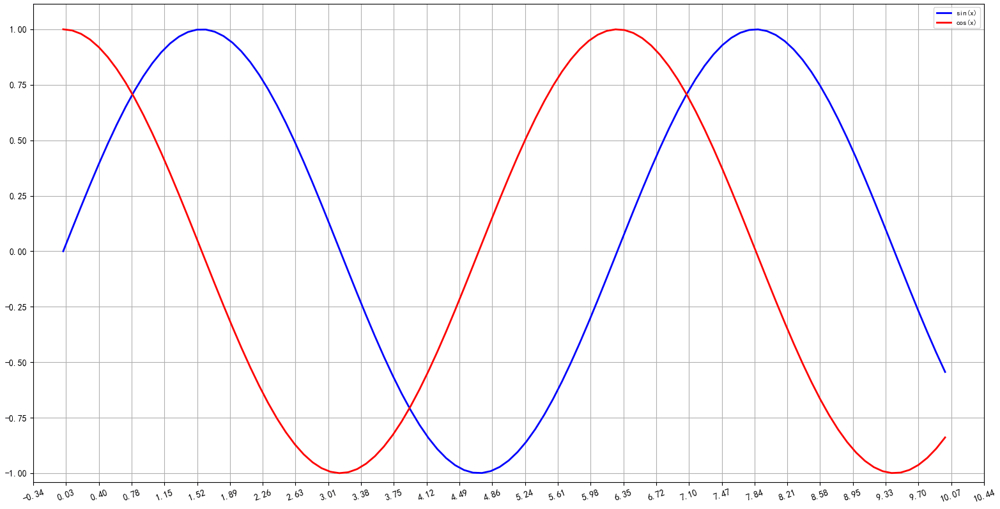

# inter-mpl: 支持交互的Matplotlib曲线绘制库
inter-mpl结合[mplcursors](https://github.com/anntzer/mplcursors)和[matplotlib](https://matplotlib.org)提供了可交互的画布和曲线, 包含以下几项功能:
* 鼠标右键拖拽
* 鼠标滚轮缩放
* 鼠标左键点击曲线显示标签(曲线名和数据点)



## 示例代码
```python
import numpy as np
from inter_mpl import InterMpl

x = np.linspace(0, 10, 100)
y1 = np.sin(x)
y2 = np.cos(x)
y3 = np.tan(x)

inter_mpl = InterMpl(figsize=(8, 6))
inter_mpl.plot(x_axis_data=x, y_axis_data=y1, label="sin(x)", color="blue", linewidth=2)
inter_mpl.plot(x_axis_data=x, y_axis_data=y2, label="cos(x)", color="red", linewidth=2)
inter_mpl.show()
```